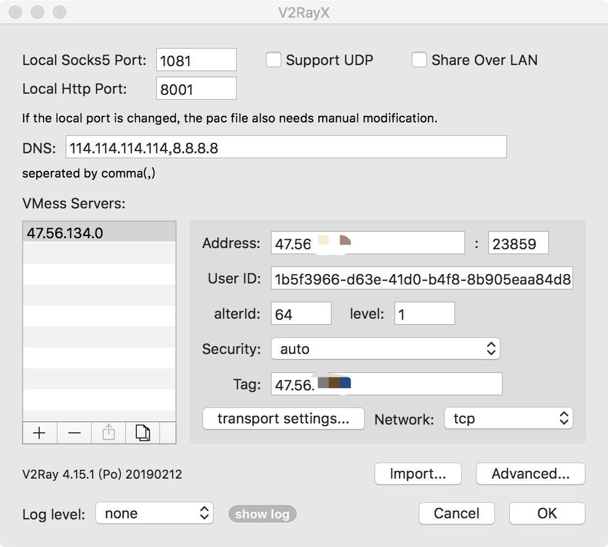

## v2ray

#### 一、下载安装
	bash <(curl -s -L https://git.io/v2ray.sh)

#### 二、启动v2ray
	systemctl start v2ray
	systemctl enable v2ray

#### 三、关闭防火墙
	iptables -F
	systemctl stop iptables
	systemctl disable iptables

	systemctl stop firewalld
	systemctl disable firewalld

#### 四、客户端配置
	客户端下载地址：https://github.com/2dust/v2rayN/releases

